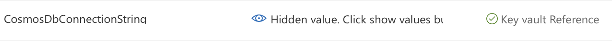
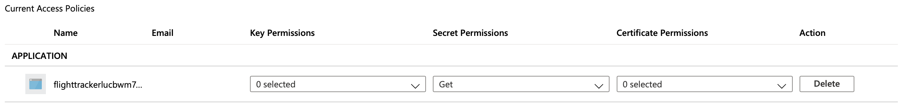
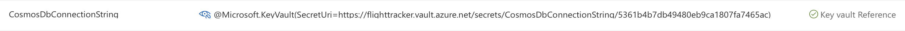

# Flight Tracker with CosmosDb, Functions and other serverless resources
Serverless solution showing how flights can be tracked using Azure Cosmos DB, Functions and SignalR.

## Quick Deploy to Azure
[](https://azuredeploy.net/)

This template created the resources required.

Below are the parameters which can be user configured in the parameters file including:

- **Application Name:** Enter the name you wish to call the application. This name will be used as a base for the resources which will get created..
- **Tenant Id:** Enter the Azure Active Directory tenant ID that should be used for authenticating requests to the key vault. The default is `[subscription().tenantId]` which should be sufficient in most cases.
- **Multi-Master:** Enter the Object Id of a user, service principal or security group in the Azure Active Directory tenant for the Key Vault. The object ID must be unique for the list of access policies. Get it by using Get-AzADUser or Get-AzADServicePrincipal cmdlets. You can also use the following CLI command to get the objectID of the loged in user: `az ad signed-in-user show --query objectId`

## Architecture
This sample is a real-time app that displays flight status details. This can be achieved through the use of [Azure Functions](https://docs.microsoft.com/en-gb/azure/azure-functions/) and [Azure SignalR](https://docs.microsoft.com/en-gb/azure/azure-signalr/). The following image describes the solution that will provide this ability:
.

More details can be found in the [documentation](https://docs.microsoft.com/en-us/azure/azure-signalr/signalr-concept-azure-functions), but an overview of the above is:
1. A change is made in a Cosmos DB collection
2. The change event is propagated to the Cosmos DB change feed
3. An Azure Functions is triggered by the change event using the Cosmos DB trigger
4. The SignalR Service output binding publishes a message to SignalR Service
5. SignalR Service publishes the message to all connected clients

## Flight Data
As the name suggests, status of flights will be required. There is a non-profit organisation called [OpenSky Network](https://opensky-network.org) which will be used to source the data for this sample. Here is a description of the OpenSky Network from OpenSky themselves:

>The OpenSky Network is a non-profit association based in Switzerland. It aims at improving the security, reliability and efficiency of the air space usage by providing open access of real-world air traffic control data to the public. The OpenSky Network consists of a multitude of sensors connected to the Internet by volunteers, industrial supporters, and academic/governmental organizations. All collected raw data is archived in a large historical database. The database is primarily used by researchers from different areas to analyze and improve air traffic control technologies and processes.

OpenSky Network provide a [REST API](https://opensky-network.org/apidoc/rest.html) that provides several functions to retrieve [state vectors](https://opensky-network.org/apidoc/index.html#state-vectors), flights and tracks for the whole network, a particular sensor, or a particular aircraft. In this sample, the `GET /states/all` operation will be used.

The request on it's own would return a lot of data. Therefore, we can limit to the bounds of, for example, the United Kindom. The following is an example of such a request:

`https://opensky-network.org/api/states/all?lamin=49.9599&lomin=-7.5721&lamax=58.6350&lomax=1.6815`

These bounds are a rough estimate so some tweeking may be required.

The details of the response can be found on the [OpenSky REST API](https://opensky-network.org/apidoc/rest.html) page, but for this sample, the following fields are used:

| Index | Property          | Type      | Description
| ---   | ---               | ---       | ---
| 0     | icao24            | string    | Unique ICAO 24-bit address of the transponder in hex string representation.
| 1     | callsign	        | string	  | Callsign of the vehicle (8 chars). Can be null if no callsign has been received.
| 2     | origin_country	  | string	  | Country name inferred from the ICAO 24-bit address.
| 5     | longitude	        | float	    | WGS-84 longitude in decimal degrees. Can be null.
| 6     | latitude	        | float	    | WGS-84 latitude in decimal degrees. Can be null.
| 7     | baro_altitude 	  | float	    | Barometric altitude in meters. Can be null.
| 9     | velocity	        | float	    | Velocity over ground in m/s. Can be null.
| 11    | vertical_rate     | float	    | Vertical rate in m/s. A positive value indicates that the airplane is climbing, a negative value indicates that it descends. Can be null.
| 14    | squawk    	      | string    | The transponder code aka Squawk. Can be null.

## Flight Data Retrieval - Azure Functions
For this sample, a serverless solution is needed and for ease of use, a timer trigger. [Azure Functions](https://docs.microsoft.com/en-gb/azure/azure-functions/) allows you to run small pieces of code (called "functions") without worrying about application infrastructure. With Azure Functions, the cloud infrastructure provides all the up-to-date servers you need to keep your application running at scale.

A function is "triggered" by a specific type of event. [Supported triggers](https://docs.microsoft.com/en-gb/azure/azure-functions/functions-triggers-bindings) include responding to changes in data, responding to messages, running on a schedule, or as the result of an HTTP request. One of those supported triggers is the [Timer trigger](https://docs.microsoft.com/en-gb/azure/azure-functions/functions-bindings-timer?tabs=csharp).

The Azure Function will call the OpenSky REST API to retrieve the flight details and store them in an Azure Cosmos DB. The idea is to see flights moving, and so the Azure Function will be triggered every 5 seconds. An example of a Timer trigger set for 5 seconds is:
```
[TimerTrigger("*/5 * * * * *")]
```

Once the data has been retrieved, it needs to be persisted to a database. This sample uses Azure Cosmos DB but more on that below.

Azure Functions in addition to Triggers, also have Output Bindings. From the [documentation](https://docs.microsoft.com/en-us/azure/azure-functions/functions-triggers-bindings):
>Binding to a function is a way of declaratively connecting another resource to the function; bindings may be connected as input bindings, output bindings, or both. Data from bindings is provided to the function as parameters.

Within the available output bindings, there is one for [Cosmos DB](https://docs.microsoft.com/en-gb/azure/azure-functions/functions-bindings-cosmosdb?tabs=csharp). An example output binding from the [documentation](https://docs.microsoft.com/en-gb/azure/azure-functions/functions-bindings-cosmosdb?tabs=csharp#queue-trigger-write-docs-using-iasynccollector):
```csharp
[DocumentDB(
    databaseName: "ToDoItems",
    collectionName: "Items",
    ConnectionStringSetting = "CosmosDBConnection")]
    IAsyncCollector<ToDoItem> toDoItemsOut
```
The sample uses the `CosmosDB` attribute.

When looking in the provided code, you are looking for a Function named `GetOpenSkyFlightData` in the `src/functions/` folder.

To run the Function locally, add the following line to your `local.settings.json` file replacing `{AccountEndpoint}` with the Account Endpoint from your Cosmos DB resource:
```csharp
"CosmosDbConnectionString": "{AccountEndpoint}",
```

## Storing the Data - Azure Cosmos DB
The data from OpenSky Network needs to be stored and [Azure Cosmos DB](https://docs.microsoft.com/en-us/azure/cosmos-db/) provides an excellent fully managed, globally-distributed, horizontally scalable in storage and throughput, multi-model database service backed up by comprehensive SLAs. More information is available from the [documentation](https://docs.microsoft.com/en-us/azure/cosmos-db/introduction).

Azure Cosmos DB also provides a "[Change Feed](https://docs.microsoft.com/en-us/azure/cosmos-db/change-feed)" which will be used to trigger an Azure Function.

The ARM Template will created the Cosmos DB as well as setup the database and container. Just for reference, here are some key details:

| Name           | Value          
| ---            | ---            
| Account name   | flighttrackerdb
| API            | Core (SQL)
| Database Name  | flighttracker
| Container Name | flights

## Azure KeyVault Function Integration and Managed Identity
There is obviously a connection string needed by the Function to connect to the Cosmos DB. This is stored in the Configuration of the Function App (the resource that contains all the Functions). However, you will see that it references a KeyVault.



### Azure KeyVault
[Azure Key Vault](https://docs.microsoft.com/en-gb/azure/key-vault/) helps solve the following problems:
* **Secrets Management** - Azure Key Vault can be used to Securely store and tightly control access to tokens, passwords, certificates, API keys, and other secrets
* **Key Management** - Azure Key Vault can also be used as a Key Management solution. Azure Key Vault makes it easy to create and control the encryption keys used to encrypt your data.
* **Certificate Management** - Azure Key Vault is also a service that lets you easily provision, manage, and deploy public and private Transport Layer Security/Secure Sockets Layer (TLS/SSL) certificates for use with Azure and your internal connected resources.
* **Store secrets backed by Hardware Security Modules** - The secrets and keys can be protected either by software or FIPS 140-2 Level 2 validated HSMs

More information is available in the [documentation](https://docs.microsoft.com/en-gb/azure/key-vault/), but here is what it says on "[Why use Azure Key Vault](https://docs.microsoft.com/en-gb/azure/key-vault/key-vault-overview#why-use-azure-key-vault)"
>Centralizing storage of application secrets in Azure Key Vault allows you to control their distribution. Key Vault greatly reduces the chances that secrets may be accidentally leaked. When using Key Vault, application developers no longer need to store security information in their application. Not having to store security information in applications eliminates the need to make this information part of the code. For example, an application may need to connect to a database. Instead of storing the connection string in the app's code, you can store it securely in Key Vault.
>
>Your applications can securely access the information they need by using URIs. These URIs allow the applications to retrieve specific versions of a secret. There is no need to write custom code to protect any of the secret information stored in Key Vault.

So, application secrets can be stored and the developers do not need to know their values. They just need to know the URI's of the secrets. New versions of Secrets can be created and old ones revoked but that is out of scope of this sample.

### Azure Function Key Vault Integration
Azure allows you to use Key Vault references for App Service and Azure Functions. The following is from the [documentation](https://docs.microsoft.com/en-gb/azure/app-service/app-service-key-vault-references):
>Key Vault references can be used as values for Application Settings, allowing you to keep secrets in Key Vault >instead of the site config. Application Settings are securely encrypted at rest, but if you need secret management >capabilities, they should go into Key Vault.
>
>To use a Key Vault reference for an application setting, set the reference as the value of the setting. Your app >can reference the secret through its key as normal. No code changes are required.

### Managed Identity
The Function App needs to talk to the KeyVault. The KeyVault being what it is, does not allow blanket access. It is therefore required to allow an app to access the KeyVault via Azure Active Directory (AAD).

From the [How to use managed identities for App Service and Azure Functions](https://docs.microsoft.com/en-gb/azure/app-service/overview-managed-identity?tabs=dotnet):
>A managed identity from Azure Active Directory (AAD) allows your app to easily access other AAD-protected >resources such as Azure Key Vault. The identity is managed by the Azure platform and does not require you to >provision or rotate any secrets. For more about managed identities in AAD, see Managed identities for Azure >resources.
>
>Your application can be granted two types of identities:
>* A **system-assigned identity** is tied to your application and is deleted if your app is deleted. An app can only have >one system-assigned identity.
>* A **user-assigned identity** is a standalone Azure resource that can be assigned to your app. An app can have multiple >user-assigned identities.

The ARM Template creates a system-assigned identity and allows the `Get` permission for `Secrets` within the KeyVault.



Your application name will be different and the ARM Template uses a unique string to ensure that the Function App name is unique around the world.

To reference a Secret in the Function App Configuration, you just need to use the [reference syntax](https://docs.microsoft.com/en-gb/azure/app-service/app-service-key-vault-references#reference-syntax):

A Key Vault reference is of the form `@Microsoft.KeyVault({referenceString})`, where `{referenceString}` is replaced by one of the following options:

| Reference string | Description
| ---   | ---
| SecretUri=secretUri  | The **SecretUri** should be the full data-plane URI of a secret in Key Vault, including a version, e.g., https://myvault.vault.azure.net/secrets/mysecret/ec96f02080254f109c51a1f14cdb1931
| VaultName=vaultName;SecretName=secretName;SecretVersion=secretVersion | The **VaultName** should the name of your Key Vault resource. The **SecretName** should be the name of the target secret. The **SecretVersion** should be the version of the secret to use.

An example of the syntax used in this example is:
`@Microsoft.KeyVault(SecretUri=https://myvault.vault.azure.net/secrets/mysecret/ec96f02080254f109c51a1f14cdb1931)`



## Azure Maps
As flights need to be displayed on a map, Azure Maps will be used. [What is Azure Maps?](https://docs.microsoft.com/en-us/azure/azure-maps/about-azure-maps):
>Azure Maps is a collection of geospatial services that use fresh mapping data to provide geographic context to web and mobile applications. Azure Maps provides:
* REST APIs to render maps in multiple styles and in satellite imagery.
* Search services to locate addresses, places, and points of interest around the world.
* Various routing options; such as point-to-point, multipoint, multipoint optimization, isochrone, commercial vehicle, traffic influenced, and matrix routing.
* Traffic flow view and incidents view, for applications that require traffic information.
* Mobility service to request public transit logistics, plan routes in real time, and request information for alternative modes of transportation.
* Time zone and geolocation services and converting a location to time zones.
Geofencing service and mapping data storage, with location information hosted in Azure.
Location intelligence through geospatial analytics.

More information can be found in the [documentation](https://docs.microsoft.com/en-us/azure/azure-maps/).

### Note on Azure Maps Authentication
From [Authentication with Azure Maps](https://docs.microsoft.com/bs-cyrl-ba/azure/azure-maps/azure-maps-authentication):
> Azure Maps supports two ways to authenticate requests: Shared Key authentication and Azure Active Directory authentication.

To authenticate with the shared key approach, the following JavaScript code needs to go in the page:

```javascript
authOptions: {
  authType: 'subscriptionKey',
  subscriptionKey: '<Azure Maps Primary Key>'
}
```
This therefore makes the primary key visible to anyone who looks at the page source. This makes authentication via Azure Active Directory (AAD) a much secure way.

To [Manage authentication in Azure Maps](https://docs.microsoft.com/en-gb/azure/azure-maps/how-to-manage-authentication), it is necessary to create an App Registration is AAD. Depending on the settings of an Azure Subscription, administrator permissions maybe required. So there is a change that running the ARM template may result in permission issues depending on the users subscription.

Shared Key authentication is therefore used in the sample to avoid those issues. However, the primary key is retrieved from the KeyVault to demo [Azure Key Vault Configuration Provider in ASP.NET Core](https://docs.microsoft.com/en-us/aspnet/core/security/key-vault-configuration?view=aspnetcore-3.1#secret-storage-in-the-production-environment-with-azure-key-vault).
